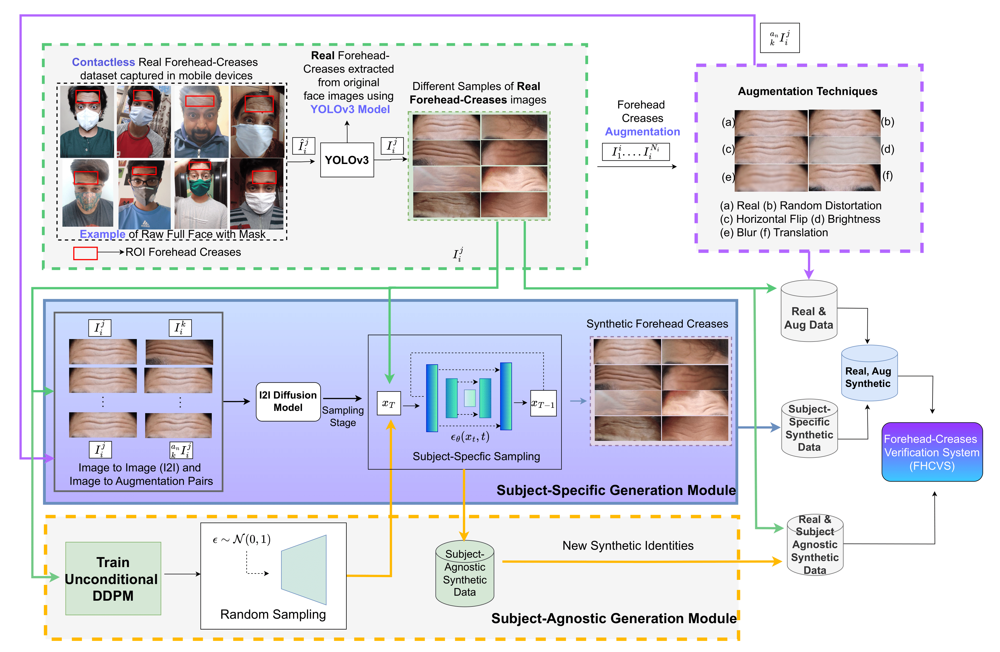

# Synthetic Forehead-Creases Biometric Generation for Reliable User Verification 
#### [Abhishek Tandon<sup>1</sup>](https://scholar.google.com/citations?user=0sXfNaQAAAAJ&hl=en), [Geetanjali Sharma<sup>1</sup>](https://scholar.google.com/citations?hl=en&user=Np8VOOAAAAAJ&view_op=list_works&sortby=pubdate), [Gaurav Jaswal<sup>2</sup>](https://scholar.google.co.in/citations?user=otGsksUAAAAJ&hl=en), [Aditya Nigam<sup>1</sup>](https://faculty.iitmandi.ac.in/~aditya/), [Raghavendra Ramachandra<sup>3</sup>](https://scholar.google.com/citations?user=OIYIrmIAAAAJ&hl=en)

##### <sup>1</sup>Indian Institute of Technology (IIT), Mandi, India, <sup>2</sup>Technology and Innovation Hub (TIH), IIT Mandi, India, <sup>3</sup>Norwegian University of Science and Technology (NTNU), Norway
--------
2024 IEEE International Joint Conference on Biometrics (IJCB)

[IEEE Xplore](https://ieeexplore.ieee.org/document/10744453) [Arxiv](https://arxiv.org/abs/2408.15693)

--------


>  Recent studies have emphasized the potential of forehead-crease patterns as an alternative for face, iris, and periocular recognition, presenting contactless and convenient solutions, particularly in situations where faces are covered by surgical masks. However, collecting forehead data presents challenges, including cost and time constraints, as developing and optimizing forehead verification methods requires a substantial number of high-quality images. To tackle these challenges, the generation of synthetic biometric data has gained traction due to its ability to protect privacy while enabling effective training of deep learning-based biometric verification methods. We present a new framework to synthesize forehead-crease image data while maintaining important features, such as uniqueness and realism. The proposed framework consists of two main modules: a Subject-Specific Generation Module (SSGM), based on an image-to-image Brownian Bridge Diffusion Model (BBDM), which learns a one-to-many mapping between image pairs to generate identity-aware synthetic forehead creases corresponding to real subjects, and a Subject-Agnostic Generation Module (SAGM), which samples new synthetic identities with assistance from the SSGM. The results indicate an improvement in the verification accuracy of a forehead-crease verification system FHCVS by utilizing synthetic data.





# Results

| Database | Dataset | Pretrained Model (FHCVS) |
|----------|:----------:|:----------:|
| FH-V1 (Real)  |  [link](https://ktiwari.in/biometrics/databases/)    |    [link](https://huggingface.co/abhi-td/synthetic-forehead-creases/tree/main/recognition/forehead-v1-adaface) |
| SS-PermuteAug (Synthetic) |    [link](https://huggingface.co/datasets/abhi-td/synthetic-forehead-creases/tree/main/subject_specific_synthetic_datasets/ss-permute-aug)      |    [link](https://huggingface.co/abhi-td/synthetic-forehead-creases/tree/main/recognition/ss_permute_aug_adaface) |
| SA-PermuteAug (Synthetic) | [link](https://huggingface.co/abhi-td/synthetic-forehead-creases/tree/main/recognition/ss_permute_aug_adaface) | |
----------
#### repository is under updation

# Citation
```
@inproceedings{tandon2024synthetic,
  title={Synthetic Forehead-creases Biometric Generation for Reliable User Verification},
  author={Tandon, Abhishek and Sharma, Geetanjali and Jaswal, Gaurav and Nigam, Aditya and Ramachandra, Raghavendra},
  booktitle={2024 IEEE International Joint Conference on Biometrics (IJCB)},
  pages={1--9},
  year={2024},
  organization={IEEE}
}
```
